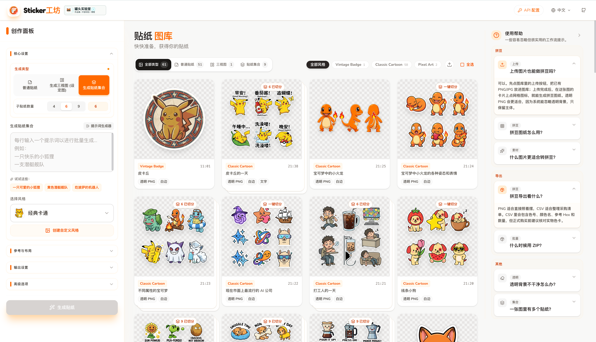

<p align="center">
  
</p>

<h1 align="center">StickerCraft AI</h1>

<p align="center">
  一个基于 Gemini 的多语言贴纸生成器，用来快速创作可直接使用的贴纸素材。
</p>

<p align="center">
  <a href="./README.md">English</a>
  ·
  <a href="#快速开始">快速开始</a>
  ·
  <a href="#gemini-配置">Gemini 配置</a>
</p>

<p align="center">
  
  
  
  
</p>

<p align="center">
  
</p>

## 项目介绍

StickerCraft AI 是一个基于 React + Vite 的贴纸生成工具，最初由 Google AI Studio 原型开发而来。它可以把自然语言提示词转换成多种风格的贴纸素材，并支持参考图、批量提示词、贴纸白边、透明背景、文字贴纸、三视图设定图、自定义风格、图库管理和 ZIP 下载。

项目支持在页面内手动配置 Gemini API Key、Endpoint、图片模型和文本模型。它既可以使用官方 Gemini API，也可以接入兼容 Gemini API 格式的中转站。

## 功能特性

- 文本生成贴纸：一行一个提示词，可批量生成。
- 多风格预设：经典卡通、Q 版、3D、像素、水彩、动漫、涂鸦等。
- 自定义风格：可手写风格描述，也可上传参考图让 Gemini 分析视觉风格。
- 参考图生成：上传图片作为生成参考。
- 贴纸控制：比例、数量、白边、面部表情、三视图、文字与背景色。
- Gemini 设置弹窗：可配置 API Key、Endpoint、图片生成模型和文本模型。
- 模型名称可自定义，适合中转站模型名不同的场景。
- 本地图库：生成结果保存到浏览器 localStorage，可预览、删除、重绘、上传、选择和 ZIP 导出。
- 多语言界面：English、中文、Español、Français、Deutsch、日本語、한국어、Português。

## Gemini 配置

打开应用后，点击右上角的 `Gemini 配置` 入口，填写以下内容：

| 配置项 | 说明 | 建议值 |
| --- | --- | --- |
| API Key | Gemini API Key 或中转站提供的 Key | 从 Google AI Studio 获取官方 Key |
| Endpoint | Gemini API 基础端点 | `https://generativelanguage.googleapis.com/` |
| 图片生成模型 | 用于生成贴纸图片 | `gemini-3.1-flash-image-preview` |
| 文本模型 | 用于风格分析和提示词生成 | `gemini-3-pro-preview` |

推荐图片模型：

- Nano Banana 2：`gemini-3.1-flash-image-preview`
- Nano Banana Pro：`gemini-3-pro-image-preview`
- Nano Banana：`gemini-2.5-flash-image`
- 自定义模型名称：适合模型名被中转站改写的情况

如果 Endpoint 已经带有版本号，例如 `https://example.com/v1beta`，项目会自动识别版本；如果只填写基础域名，则默认使用 `v1beta`。

> 安全提示：这个项目是纯前端应用，API Key 会保存在浏览器 localStorage，并由浏览器直接请求 Gemini。适合个人本地使用。若要公开部署，建议增加后端代理、鉴权、额度控制和防滥用策略。

## 快速开始

### 环境要求

- Node.js 18+
- npm
- Gemini API Key

### 安装依赖

```bash
npm install
```

### 启动开发服务器

```bash
npm run dev
```

默认开发地址：

```text
http://localhost:3000
```

首次打开页面后，进入右上角 `Gemini 配置` 弹窗填写 API Key、Endpoint、图片模型和文本模型。保存后即可生成贴纸。

### 可选：使用环境变量作为默认 Key

你可以创建 `.env.local`，让本地开发时自动填入默认 API Key：

```bash
GEMINI_API_KEY=your_gemini_api_key_here
```

页面配置优先使用 localStorage。即使设置了 `.env.local`，用户仍然可以在页面弹窗里覆盖 API Key、Endpoint、图片模型和文本模型。

## 构建

```bash
npm run build
```

构建产物输出到 `dist/`。

本地预览构建结果：

```bash
npm run preview
```

## 项目结构

```text
.
├── App.tsx                         # 应用主布局、图库状态、生成流程
├── components/
│   ├── ControlPanel.tsx            # 提示词、风格、模型和生成配置
│   ├── GeneratedGrid.tsx           # 图库、选择、上传、ZIP 下载
│   ├── Header.tsx                  # Logo、语言菜单、Gemini 配置弹窗
│   └── StickerCard.tsx             # 单张贴纸卡片
├── contexts/
│   └── LanguageContext.tsx         # 多语言状态
├── docs/
│   └── images/                     # README 展示图
├── public/
│   └── logo.svg                    # 应用 Logo 和 favicon
├── services/
│   ├── geminiConfig.ts             # Gemini 配置读写、Endpoint 解析、模型建议
│   └── geminiService.ts            # 图片生成、风格分析、提示词生成
├── constants.ts                    # 预设、翻译、比例、字体、颜色
├── types.ts                        # 共享类型
├── index.html                      # Vite HTML 入口
└── index.tsx                       # React 挂载入口
```

## 使用建议

- 生成普通贴纸时，优先使用 Nano Banana 2：`gemini-3.1-flash-image-preview`。
- 需要专业资产、复杂指令、文字渲染或 4K 尺寸时，使用 Nano Banana Pro：`gemini-3-pro-image-preview`。
- 需要更低延迟时，可以使用 Nano Banana：`gemini-2.5-flash-image`。
- 文本模型可以使用 Gemini 3 Pro：`gemini-3-pro-preview`。
- 使用中转站时，确保 Endpoint 兼容 Gemini API 的 `generateContent` 请求格式，而不是 OpenAI Chat Completions 格式。
- 如果生成按钮不可用，检查提示词是否为空，以及自定义模型名称是否已填写。

## 常见问题

### 为什么配置了 Endpoint 还是请求失败？

请确认该 Endpoint 是 Gemini API 兼容端点。项目使用 `@google/genai` SDK 的 `models.generateContent`，并不是 OpenAI Chat Completions 格式。

### 自定义模型为什么没有 2K/4K 分辨率选项？

官方 Nano Banana 2 和 Nano Banana Pro 支持更高分辨率配置。对于自定义模型名，项目会对看起来像 Pro 图片模型的名称开放分辨率选项，但最终是否支持取决于实际端点。

### API Key 存在哪里？

保存在浏览器 localStorage 的 `stickerCraft_geminiSettings` 中。清空浏览器站点数据或点击配置弹窗里的“恢复官方默认”可清除已保存配置。

### 可以直接部署到公网吗？

可以，但不建议把个人 API Key 放在前端给公网用户使用。公开部署前建议增加后端代理、鉴权和额度控制。

## 贡献

欢迎提交 issue 和 pull request。适合优先完善的方向包括：

- 更完整的多语言翻译和风格名本地化。
- 更多贴纸风格预设。
- 适合公开部署的后端代理。
- 生成配置的导入和导出。
